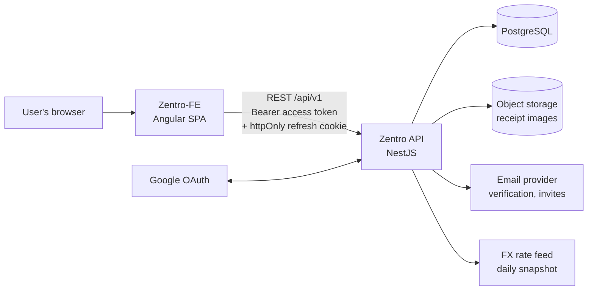
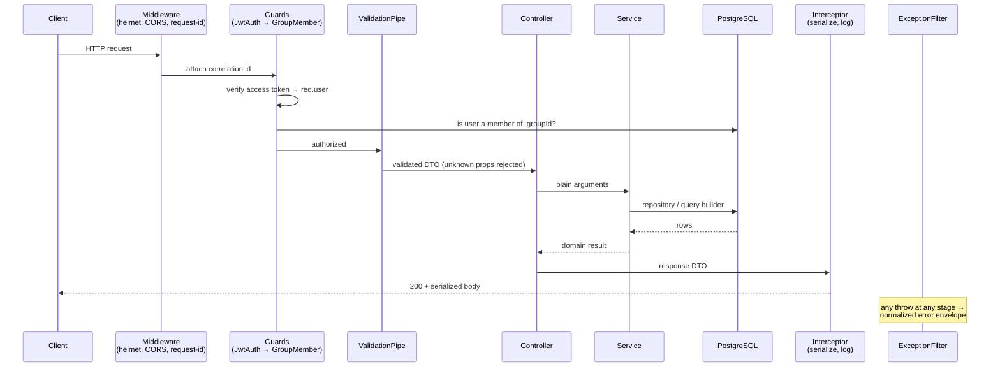

# Architecture — Zentro API

How this service is put together and why. For the tables themselves see
[docs/data-model.md](./docs/data-model.md); for decisions and their tradeoffs see
[docs/adr/](./docs/adr/).

---

## 1. System context



Zentro is a two-repo product. This service owns **all** business logic and is the only
thing that touches the database. The SPA is a pure consumer — it holds no authority and
enforces no rules, so any check that matters must exist here.

---

## 2. Layers

Strictly one direction. A layer may call downward, never upward, never sideways.

```
HTTP  →  Controller  →  Service  →  Repository  →  PostgreSQL
```

| Layer | Owns | Must never |
|---|---|---|
| **Controller** | Route definition, DTO validation, guards, Swagger, HTTP status | Contain business logic; inject a repository; return an entity |
| **Service** | All business rules, transactions, orchestration | Touch `Request`/`Response`, cookies, headers, or HTTP status codes |
| **Repository / Entity** | Persistence, relations, indexes | Contain business rules |

**Why the service layer is HTTP-blind:** the split-calculation and balance logic is the part
most worth testing and most likely to be reused (a scheduled job, a CLI backfill, a future
webhook). Anything a service needs from the request — the current user id, the group id —
arrives as an ordinary argument. This keeps every business rule unit-testable without
constructing a fake HTTP request.

### Module organisation

One module per **aggregate**, not per technical layer:

```
src/modules/
  auth/           registration, login, tokens, Google OAuth, verification, reset
  users/          profile, preferences, avatar
  groups/         groups, membership, roles, invites
  expenses/       expenses, payers, splits, split strategies
  settlements/    settle-up records
  attachments/    receipt upload, presigned URLs
  currencies/     currency list, FX rate snapshots
  activity/       activity feed
```

A module exposes a service to other modules and keeps everything else private. When two
modules need the same logic, it moves to `src/common/` rather than being imported across
feature boundaries.

---

## 3. Request lifecycle

Every request passes through the same pipeline. Understanding this explains most
"why isn't my change taking effect?" questions.



**Global, applied in `main.ts`:**

| Component | Purpose |
|---|---|
| `helmet` | Standard security headers |
| CORS allowlist | Only the known frontend origins, `credentials: true` for the refresh cookie |
| `ValidationPipe` | `whitelist`, `forbidNonWhitelisted`, `transform` |
| `JwtAuthGuard` | Applied globally; routes opt out with `@Public()` |
| `ThrottlerGuard` | Rate limiting, tightened further on auth routes |
| `ClassSerializerInterceptor` | Strips `@Exclude()` fields as a second line of defence |
| `AllExceptionsFilter` | Normalizes every error to one envelope |
| `LoggerModule` (pino) | Structured JSON logs with a correlation id per request |

> **Gotcha:** `forbidNonWhitelisted` means a property missing a `class-validator` decorator
> causes a **400**, not a silent drop. If a field "isn't arriving", check the DTO first.

---

## 4. Authentication and authorization

Two separate concerns, deliberately handled in different places.

**Authentication — who are you?** Handled once, globally.

- Access token: JWT, ~15 min, sent as `Authorization: Bearer`. Held in memory by the SPA.
- Refresh token: opaque, ~30 days, **httpOnly + Secure + SameSite cookie**, rotated on
  every use, tracked as a family so that reuse of a spent token revokes the whole family.
- Passwords: argon2id. Google OAuth users may have no password at all.

Full token lifecycle and rationale: [docs/security.md](./docs/security.md) and
[ADR-0002](./docs/adr/0002-jwt-refresh-rotation.md).

**Authorization — may you touch *this* record?** Handled per-route.

This is where an expense-sharing app is most likely to be broken. Knowing a group's UUID
must never be enough to read it. Therefore:

- `GroupMemberGuard` — resolves `:groupId` (or the group behind `:expenseId`) and asserts
  active membership.
- `GroupAdminGuard` — additionally asserts `owner`/`admin` role.
- Services take the acting user id and scope queries by it. **Never** `findOne(id)` on a
  group-owned record without a membership predicate in the same query.

---

## 5. The money model

The core of the product, and the easiest thing to get subtly wrong.

**Amounts are `bigint` minor units plus an ISO-4217 code.** `12.30 EUR` is `1230` + `'EUR'`.
Floats are banned: `0.1 + 0.2 !== 0.3`, and in a ledger that silently becomes a cent that
belongs to nobody. See [ADR-0003](./docs/adr/0003-money-as-integer-minor-units.md).

**Splits must sum exactly.** For every expense:

```
Σ expense_splits.amount_minor  ===  expenses.amount_minor
Σ expense_payers.amount_minor  ===  expenses.amount_minor
```

Dividing 10.00 three ways gives 3.34 / 3.33 / 3.33, never 3.33 × 3. Remainder pennies are
assigned by **largest remainder**, with a deterministic tie-break on user id so the same
input always produces the same output. This lives in one shared helper in `src/common/money/`
and is the single most heavily unit-tested code in the repo.

**Balances are SQL aggregates.** A user's position in a group is:

```
balance = Σ(what they paid) − Σ(what they owe) + Σ(settlements they made) − Σ(settlements received)
```

computed by the database, never by loading expenses into Node. Groups accumulate thousands
of expenses; the in-memory version works fine in development and falls over in production.

**Settling up is a record, not a mutation.** A settlement is an immutable row. Expenses are
never edited to "mark as paid" — the ledger stays append-only and auditable.

---

## 6. Multi-currency

An expense carries its **own** currency; a group carries a **default** currency.

When they differ, the FX rate is **snapshotted onto the expense row at creation time**
(`fx_rate`, plus the converted `amount_group_minor`). Rates are never applied retroactively.

This is a deliberate choice: if balances were recomputed at today's rate, a debt would
silently change size every day and would never reconcile against what people actually paid.
Snapshotting means a historical expense always converts the way it did on the day. See
[ADR-0006](./docs/adr/0006-fx-rate-snapshotting.md).

---

## 7. Error handling

One envelope for every failure, so the client has exactly one shape to handle:

```json
{
  "type": "https://zentro.app/errors/validation-failed",
  "title": "Validation failed",
  "status": 400,
  "detail": "amountMinor must be a positive integer",
  "instance": "/api/v1/expenses",
  "requestId": "01J8XY...",
  "errors": [{ "field": "amountMinor", "message": "must be a positive integer" }]
}
```

Services throw **domain exceptions** (`GroupNotFoundError`, `SplitMismatchError`), not
`HttpException`. The filter maps domain exceptions to status codes. This keeps services
HTTP-blind, per §2. Conventions: [docs/api/README.md](./docs/api/README.md).

`requestId` is on every response and every log line — it is how a user's bug report gets
traced to a stack trace.

---

## 8. Testing strategy

| Level | Tool | Covers |
|---|---|---|
| **Unit** | Jest, no DB | Split allocation, balance math, debt simplification, token logic. Fast, exhaustive, includes property-based cases for penny allocation. |
| **Integration** | Jest + Supertest + real Postgres | A route end-to-end through guards, pipes, service and DB. Every endpoint gets at least an authorized-success and an unauthorized-denied case. |
| **Migration** | CI job | All migrations run clean against an empty database, and entities produce no further diff (drift guard). |

The authorization tests matter as much as the happy path: for every group-scoped route
there is a test asserting that a **non-member gets 404** (not 403 — we don't confirm the
resource exists). Details: [docs/testing.md](./docs/testing.md).

---

## 9. What this architecture deliberately does not have

Named so nobody re-litigates them without cause:

- **No CQRS, no event sourcing.** The ledger is append-only, which gets most of the benefit
  at a fraction of the complexity.
- **No microservices.** One deployable. The domain is small and highly relational.
- **No GraphQL.** The client's needs are well-known and REST + OpenAPI gives us free
  cross-repo type generation.
- **No caching layer yet.** Balance queries are the only plausible hotspot; measure before
  adding Redis.
- **No soft-delete on everything.** Only where history genuinely matters (expenses,
  settlements, users). Elsewhere, delete means delete.
