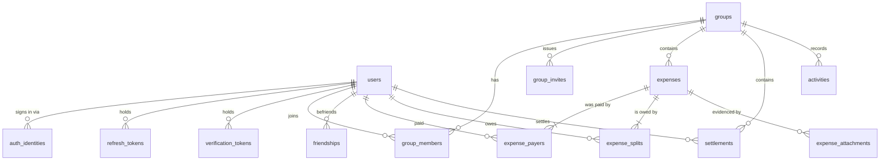

# Data model

The authoritative description of Zentro's schema. Read this before writing anything that
touches expenses, splits, balances or settlements — the invariants below are load-bearing
and are **not** obvious from the entity classes alone.

Conventions used throughout:

- Primary keys are `uuid` (v7 where available, so they sort by creation time).
- Timestamps are `timestamptz`, always UTC. Never `timestamp`.
- Money is `bigint` **minor units** + a `char(3)` ISO-4217 code. Never `float`, `real`,
  `double precision`, or a bare `numeric` without a paired currency.
- `deleted_at timestamptz NULL` marks soft-deleted rows. Only tables noted below have it.
- Snake_case in the database, camelCase in TypeScript. TypeORM maps between them.

---

## Entity relationship overview



---

## Identity

### `users`

The person. Exists independently of any group.

| Column | Type | Notes |
|---|---|---|
| `id` | uuid PK | |
| `email` | citext | **unique**. `citext` so `Ali@x.com` and `ali@x.com` are one account. |
| `password_hash` | text NULL | **Nullable** — Google-only users never set one. |
| `display_name` | text | |
| `avatar_url` | text NULL | |
| `default_currency` | char(3) | Seeds the currency of groups they create. |
| `email_verified_at` | timestamptz NULL | NULL ⇒ unverified. Gate sensitive actions on this. |
| `created_at`, `updated_at` | timestamptz | |
| `deleted_at` | timestamptz NULL | Soft delete — a departed user's expenses must survive. |

> **`password_hash` being nullable is deliberate.** Every code path that compares a password
> must handle `null` by rejecting, not by throwing. A user who signed up with Google and
> then tries email login should get "invalid credentials", not a 500.

> **Deleting a user is a soft delete, always.** Their name appears on historical expenses
> that other people still owe against. Hard-deleting corrupts other users' balances.

### `auth_identities`

External identity providers. One row per provider link.

| Column | Type | Notes |
|---|---|---|
| `id` | uuid PK | |
| `user_id` | uuid FK → users | |
| `provider` | enum | `google` today; the table exists so adding another is not a migration of `users`. |
| `provider_user_id` | text | The provider's stable subject id — **not** the email, which can change. |
| `created_at` | timestamptz | |

Unique on `(provider, provider_user_id)`.

### `refresh_tokens`

Opaque refresh tokens, rotated on every use.

| Column | Type | Notes |
|---|---|---|
| `id` | uuid PK | |
| `user_id` | uuid FK → users | |
| `token_hash` | text | **SHA-256 of the token. The raw token is never stored.** |
| `family_id` | uuid | All descendants of one login share a family. |
| `expires_at` | timestamptz | |
| `revoked_at` | timestamptz NULL | |
| `replaced_by` | uuid NULL FK → self | Set when rotated. |
| `user_agent`, `ip` | text NULL | For the "active sessions" screen. |

Indexed on `token_hash` and on `(user_id, revoked_at)`.

> **Reuse detection:** presenting a token that already has `replaced_by` set means the token
> was stolen and replayed. The correct response is to revoke the **entire family**, not just
> that row, and force re-login. See [security.md](./security.md).

### `verification_tokens`

Email verification and password reset. Same hash-don't-store rule.

| Column | Type | Notes |
|---|---|---|
| `id` | uuid PK · `user_id` | uuid FK |
| `type` | enum | `email_verify` \| `password_reset` |
| `token_hash` | text | |
| `expires_at` | timestamptz | Short — 1 h for reset, 24 h for verification. |
| `used_at` | timestamptz NULL | Single-use. A used token must be rejected. |

---

## Groups

### `groups`

| Column | Type | Notes |
|---|---|---|
| `id` | uuid PK | |
| `name` | text | |
| `description` | text NULL | |
| `default_currency` | char(3) | The currency balances are reported in. |
| `avatar_url` | text NULL | |
| `simplify_debts` | boolean | Default `true`. Controls whether the settle-up plan nets debts across members. |
| `created_by` | uuid FK → users | |
| `created_at`, `updated_at`, `deleted_at` | timestamptz | Soft delete. |

### `group_members`

| Column | Type | Notes |
|---|---|---|
| `id` | uuid PK · `group_id` · `user_id` | FKs |
| `role` | enum | `owner` \| `admin` \| `member` |
| `joined_at` | timestamptz | |
| `left_at` | timestamptz NULL | Left, not deleted — see below. |

Unique on `(group_id, user_id)`. Indexed on `(user_id, left_at)` — this index backs the
membership guard, which runs on nearly every request.

> **Leaving sets `left_at`; it does not delete the row.** A departed member still appears on
> historical expenses. Membership *checks* must filter `left_at IS NULL`; balance *queries*
> must not.

> **A member with a non-zero balance may not leave.** Enforce in the service. Allowing it
> silently destroys the group's ability to reconcile.

### `group_invites`

| Column | Type | Notes |
|---|---|---|
| `id` | uuid PK · `group_id` · `invited_by` | FKs |
| `email` | citext NULL | NULL ⇒ a shareable link rather than a targeted invite. |
| `token_hash` | text | |
| `role` | enum | Role granted on acceptance. |
| `expires_at` | timestamptz | |
| `accepted_at` | timestamptz NULL · `accepted_by` | uuid NULL FK |

### `friendships`

Supports one-on-one expenses outside any group.

| Column | Type | Notes |
|---|---|---|
| `id` | uuid PK · `requester_id` · `addressee_id` | FKs → users |
| `status` | enum | `pending` \| `accepted` \| `blocked` |

Store the pair **canonically ordered** (lower uuid first) with a unique constraint, so
A→B and B→A cannot both exist.

---

## The ledger

### `expenses`

| Column | Type | Notes |
|---|---|---|
| `id` | uuid PK | |
| `group_id` | uuid NULL FK | **NULL ⇒ a one-on-one expense between friends.** |
| `description` | text · `notes` text NULL | |
| `amount_minor` | bigint | Total, in `currency`. |
| `currency` | char(3) | The expense's own currency. |
| `fx_rate` | numeric(20,10) | Rate to the group currency **at creation time**. `1` when equal. |
| `amount_group_minor` | bigint | `amount_minor` converted. Denormalized so balance SQL never joins rates. |
| `category` | text NULL | |
| `split_type` | enum | `equal` \| `exact` \| `percentage` \| `shares` |
| `paid_at` | timestamptz | When it happened — not `created_at`. |
| `created_by` | uuid FK | |
| `created_at`, `updated_at`, `deleted_at` | timestamptz | Soft delete. |

Indexed on `(group_id, paid_at DESC)` for the feed and `(group_id, deleted_at)` for balances.

### `expense_payers`

Who actually paid. Separate from splits because **the payer is not always one person**
(two people split the bill at the till).

| Column | Type |
|---|---|
| `id` uuid PK · `expense_id` FK · `user_id` FK · `amount_minor` bigint |

### `expense_splits`

Who owes what.

| Column | Type | Notes |
|---|---|---|
| `id` uuid PK · `expense_id` FK · `user_id` FK | | |
| `share_units` | numeric NULL | The *input*: percentage, share count, or NULL for equal. |
| `amount_minor` | bigint | The *resolved* amount. Always populated. |

Unique on `(expense_id, user_id)`.

> **Why store both the input and the resolved amount:** the input is needed to re-render the
> edit form the way the user filled it in; the resolved amount is what the ledger owes
> against. Recomputing from the input on every read would risk drift.

### `expense_attachments`

| Column | Type | Notes |
|---|---|---|
| `id` uuid PK · `expense_id` FK · `uploaded_by` FK | | |
| `storage_key` | text | Object-storage key. **Never a public URL** — reads go through a signed URL. |
| `mime`, `size_bytes`, `width`, `height` | | Validated server-side, not trusted from the client. |

### `settlements`

A payment from one member to another. **Immutable once created** — correcting one means
voiding and re-creating, so the audit trail stays honest.

| Column | Type | Notes |
|---|---|---|
| `id` uuid PK | | |
| `group_id` | uuid NULL FK | NULL ⇒ settling a one-on-one balance. |
| `from_user_id`, `to_user_id` | uuid FK | |
| `amount_minor`, `currency`, `fx_rate`, `amount_group_minor` | | Same rules as expenses. |
| `settled_at` | timestamptz · `method` text NULL · `note` text NULL | |
| `created_by` | uuid FK · `created_at` | |

### `activities`

Append-only feed. Never the source of truth for anything — purely a display artifact.

| Column | Type |
|---|---|
| `id` uuid PK · `group_id` FK NULL · `actor_id` FK · `type` enum · `subject_type` text · `subject_id` uuid · `payload` jsonb · `created_at` |

`payload` snapshots what was shown at the time, so the feed still reads correctly after the
underlying expense is edited or deleted.

### `fx_rates`

Daily rate cache. Read when creating a cross-currency expense, then snapshotted onto it.

| Column | Type |
|---|---|
| `base` char(3) · `quote` char(3) · `rate` numeric(20,10) · `as_of` date |

Unique on `(base, quote, as_of)`.

---

## Invariants

These must hold at all times. Each has a test; several have a database constraint. **If you
are changing ledger code, these are what you can break.**

1. **`Σ expense_splits.amount_minor === expenses.amount_minor`** — exactly, in minor units.
   Never approximately.
2. **`Σ expense_payers.amount_minor === expenses.amount_minor`** — exactly.
3. **Remainder pennies are allocated by largest remainder**, tie-broken deterministically by
   user id. £10.00 across three people is 3.34/3.33/3.33 — and it is the *same* person who
   gets the extra penny every time the same expense is recalculated.
4. **Every split's `user_id` is a member of the expense's group** (or a party to the
   friendship, for `group_id IS NULL`). Enforced in the service.
5. **A settlement's `from_user_id !== to_user_id`.** Database check constraint.
6. **All amounts are `> 0`.** A refund is not a negative expense — it is a settlement in the
   opposite direction. Database check constraint.
7. **`fx_rate` is snapshotted at creation and never updated.** Recomputing historical
   balances at today's rate makes debts unreconcilable — see
   [ADR-0006](./adr/0006-fx-rate-snapshotting.md).
8. **Soft-deleted expenses are excluded from every balance query.** The single most likely
   way to produce a wrong balance is forgetting `deleted_at IS NULL`.

---

## Derived values

Neither of these is a table. Both are computed on read.

### Balance

Per user, per group, in the group's currency:

```
balance = Σ paid (expense_payers, via non-deleted expenses)
        − Σ owed (expense_splits, via non-deleted expenses)
        + Σ settlements paid out
        − Σ settlements received
```

Positive ⇒ the group owes them. Negative ⇒ they owe the group. **Balances across a group
always sum to zero** — a useful assertion to keep in the test suite, since any violation
means the ledger has been corrupted.

Computed as a single SQL aggregate. Never by loading rows into Node.

### Settle-up plan

Given net balances, produce the minimum set of payments that clears them. Greedy
min-cash-flow: repeatedly match the largest debtor against the largest creditor. For *n*
members this yields at most *n−1* payments instead of a possible *n(n−1)/2*.

Controlled per group by `simplify_debts`. When off, debts are reported pairwise as they were
actually incurred — some people prefer to pay back the specific person they borrowed from.
